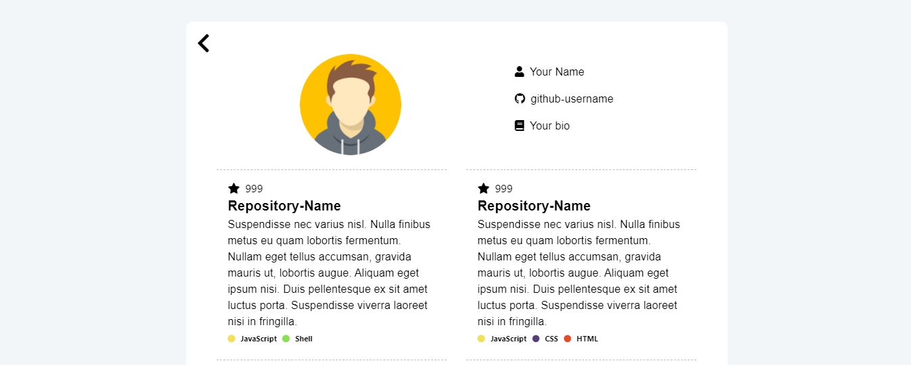

<h1 align='center'>GitHub Resume Generator</h1>



## Seznam obsahu

- [O projektu](#about)
- [Použité nástroje](#built-with)
- [Instalace](#installation)
- [Demo](#live-demo)

<br>

### 🌎 _Čti v [jiných jazycích](./Translations.md)_

<h2 id='about'>🤔 O projektu</h2>

Cíl tohoto repozitáře je vygenerovat `Github resumé` pro každého uživatele Github.

<h2 id='built-with'>🛠️ Použité nástroje</h2>

- [React JS](https://reactjs.org/) - Front-End JavaScript library
- [Material UI](https://material-ui.com/) - React UI Framework

<h2 id='installation'>Instalace</h2>

Chceš-li nastavit aplikaci k vývoji na tvém lokálním stroji, následuj prosím pokyny níže:

1. Naklonuj si repozitář na svůj stroj

```bash
git clone https://github.com/sabesansathananthan/React-GitHub-Resume.git
cd React-GitHub-Resume
```

2. Nainstaluj balíčky

   Používáš-li `npm`

   ```bash
   npm install
   ```

   nebo

   používáš-li `yarn`

   ```bash
   yarn
   ```

3. Spusť vývojářský server

   Používáš-li `npm`

   ```bash
   npm start
   ```

   nebo

   používáš-li `yarn`

   ```bash
   yarn start
   ```

4. Přejdi na adresu <http://localhost:3000>

<h2 id='live-demo'><a href="https://react-github-resume.vercel.app/">Živé demo</a></h2>

[](https://vercel.com/new/git/external?repository-url=https://github.com/sabesansathananthan/React-GitHub-Resume)

## 📄 Licenci

Tento projekt spadá pod licenci MIT — pro více detailů navštiv soubor s [LICENCÍ](../LICENSE)
